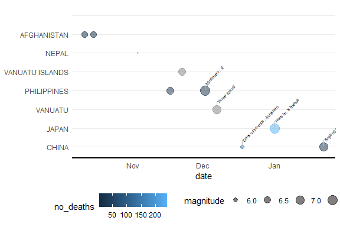

<!-- README.md is generated from README.Rmd. Please edit that file -->

# visualizeNOAA

<!-- badges: start -->
<!-- badges: end -->

# Introduction

This vignette provides an overview of the `visualizeNOAA` package
functionalities for cleaning and visualizing earthquake data from NOAA.

## Installation

You can install the package from GitHub using the following command:

``` r
#devtools::install_github("apd/visualizeNOAA")
```

## Loading the Package

Once installed, load the package into your R session:

``` r
library(visualizeNOAA)
library(tidyverse)
library(leaflet)
```

## Cleaning NOAA Earthquake Data

The eq_clean_data() function cleans the raw NOAA earthquake data. It
reads the data from a tab-delimited file, creates a date column, and
converts latitude and longitude to numeric class.

``` r
cleaned_data <- eq_clean_data("inst/extdata/earthquakes.tsv")
cleaned_data %>%
  head()
#> # A tibble: 6 × 6
#>   date       latitude longitude Location.Name                   magnitude no_deaths
#>   <date>        <dbl>     <dbl> <chr>                               <dbl>     <dbl>
#> 1 0480-09-29     37.9      23.5 GREECE:  SARONIC GULF                  NA        NA
#> 2 0186-02-22     33.8     106.  CHINA:  GANSU PROVINCE                  7       760
#> 3 0070-06-01     36.3     119   CHINA:  SHANDONG PROVINCE               7      6000
#> 4 0047-04-17     34.9     105.  CHINA:  GANSU PROVINCE:  LONGXI        NA        NA
#> 5 0031-09-02     32        35.5 ISRAEL:  QUMRAN,ARIHA (JERICHO)         7        NA
#> 6 0037-04-09     36.1      36.1 TURKEY:  ANTAKYA (ANTIOCH)             NA        NA
```

## Cleaning Earthquake Location Names

The eq_location_clean() function cleans the LOCATION_NAME column by
stripping out the country name and converting names to title case.

``` r
cleaned_location <- eq_location_clean(cleaned_data)
cleaned_location %>% 
  head()
#> # A tibble: 6 × 8
#>   date       latitude longitude Location.Name                         country         location               magnitude no_deaths
#>   <date>        <dbl>     <dbl> <chr>                                 <chr>           <chr>                      <dbl>     <dbl>
#> 1 2024-01-22    41.3       78.6 CHINA: XINJIANG PROVINCE;  KAZAKHSTAN CHINA           Xinjiang Province;  K…       7           3
#> 2 2024-01-01    37.5      137.  JAPAN: HONSHU: ISHIKAWA               JAPAN           Honshu: Ishikawa             7.5       241
#> 3 2023-12-18    35.7      103.  CHINA:  GANSU PROVINCE: JISHISHAN     CHINA           Gansu Province: Jishi…       5.9       151
#> 4 2023-12-07   -20.7      169.  VANUATU:  TANNA ISLAND                VANUATU         Tanna Island                 7.1        NA
#> 5 2023-12-02     8.53     126.  PHILIPPINES:  MINDANAO:  E            PHILIPPINES     Mindanao:  E                 7.6         3
#> 6 2023-11-22   -15.0      168.  VANUATU ISLANDS: MAEWO                VANUATU ISLANDS Maewo                        6.7        NA
```

## Visualizing Earthquake Data

### Timeline of Earthquakes

The geom_timeline() function plots a timeline of earthquakes.

``` r
df_visualize <- bind_rows(
  cleaned_location %>%
    head(10),
  data.frame(country="", location ="")) %>% 
  mutate(country=factor(country, levels = unique(country))) 
ggplot(data = df_visualize) +
  geom_timeline(aes(date,size = magnitude,  color = no_deaths)) +
  theme_minimal() +
  theme(
    axis.line.x = element_line(linewidth = 0.75),
    axis.title.y = element_blank(),
    panel.grid.major.x = element_blank(),
    panel.grid.minor.x = element_blank(),
    legend.position = "bottom"
  )
#> Warning: Removed 1 rows containing missing values (`geom_timeline()`).
```


### Timeline of Earthquakes

The geom_timelinelabel() function includes label as well.

``` r
ggplot(data = df_visualize) +
  geom_timeline(aes(date,country, size = magnitude,  color = no_deaths))  +
  geom_timelinelabel(aes(date,country,label = location), n_max = 5) +
  theme_minimal() +
  theme(
    axis.line.x = element_line(linewidth = 0.75),
    axis.title.y = element_blank(),
    panel.grid.major.x = element_blank(),
    panel.grid.minor.x = element_blank(),
    legend.position = "bottom"
  )
#> Warning: Removed 1 rows containing missing values (`geom_timeline()`).
#> Warning: Removed 1 rows containing missing values (`geom_timeline_label()`).
```


